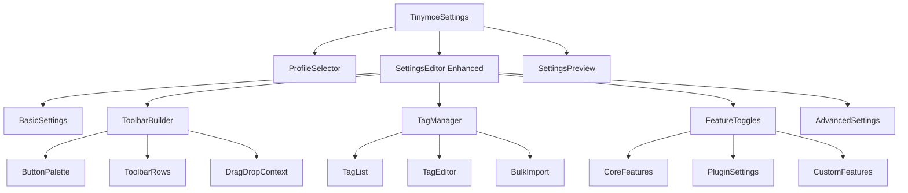
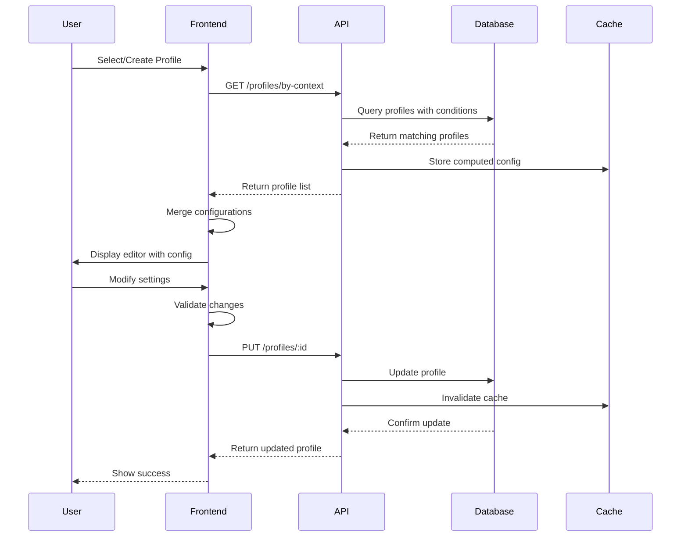

# TinyMCE Configuration System - Technical Specification

## Overview

This document outlines the comprehensive design for an enhanced TinyMCE editor configuration system that builds upon the existing infrastructure to provide a more robust profile management system with improved UI controls and security features.

## Current System Analysis

The existing system includes:
- **Database Model**: `TinymceSettings` with JSONB storage for configurations
- **API Endpoints**: Full CRUD operations, import/export, and duplicate functionality
- **Frontend Components**: Settings management UI with preview capability
- **Integration**: TinyMCE editor accepts `editorConfig` prop for dynamic configuration

## Enhanced System Architecture

### 1. Database Schema Design

#### Existing Schema (TinymceSettings)
```sql
TinymceSettings {
  id: UUID (primary key)
  name: STRING (unique, required)
  description: TEXT
  settings: JSONB (required)
  isDefault: BOOLEAN
  isPreset: BOOLEAN
  tags: ARRAY[STRING]
  createdBy: UUID (FK to Users)
  updatedBy: UUID (FK to Users)
  createdAt: TIMESTAMP
  updatedAt: TIMESTAMP
}
```

#### New Tables/Enhancements

##### TinymceProfiles (Enhancement to existing TinymceSettings)
```sql
-- Add new columns to existing table
ALTER TABLE TinymceSettings ADD COLUMN IF NOT EXISTS
  profileType: ENUM('system', 'user', 'content_type', 'custom') DEFAULT 'custom',
  priority: INTEGER DEFAULT 0,
  conditions: JSONB DEFAULT '{}',
  allowedUsers: ARRAY[UUID] DEFAULT '{}',
  allowedRoles: ARRAY[STRING] DEFAULT '{}',
  metadata: JSONB DEFAULT '{}';

-- Index for performance
CREATE INDEX idx_tinymce_profiles_type ON TinymceSettings(profileType);
CREATE INDEX idx_tinymce_profiles_priority ON TinymceSettings(priority);
```

##### TinymceToolbarPresets
```sql
CREATE TABLE TinymceToolbarPresets (
  id: UUID PRIMARY KEY DEFAULT gen_random_uuid(),
  name: VARCHAR(100) UNIQUE NOT NULL,
  description: TEXT,
  toolbar_config: JSONB NOT NULL,
  button_order: JSONB NOT NULL,
  is_system: BOOLEAN DEFAULT false,
  created_at: TIMESTAMP DEFAULT CURRENT_TIMESTAMP,
  updated_at: TIMESTAMP DEFAULT CURRENT_TIMESTAMP
);
```

##### TinymceAllowedTags
```sql
CREATE TABLE TinymceAllowedTags (
  id: UUID PRIMARY KEY DEFAULT gen_random_uuid(),
  profile_id: UUID REFERENCES TinymceSettings(id) ON DELETE CASCADE,
  tag_name: VARCHAR(50) NOT NULL,
  attributes: JSONB DEFAULT '{}',
  is_void: BOOLEAN DEFAULT false,
  created_at: TIMESTAMP DEFAULT CURRENT_TIMESTAMP,
  UNIQUE(profile_id, tag_name)
);
```

##### TinymceFeatureFlags
```sql
CREATE TABLE TinymceFeatureFlags (
  id: UUID PRIMARY KEY DEFAULT gen_random_uuid(),
  profile_id: UUID REFERENCES TinymceSettings(id) ON DELETE CASCADE,
  feature_name: VARCHAR(100) NOT NULL,
  enabled: BOOLEAN DEFAULT true,
  config: JSONB DEFAULT '{}',
  UNIQUE(profile_id, feature_name)
);
```

### 2. Enhanced Settings Structure

```javascript
{
  // Basic Settings
  name: "Article Editor Pro",
  description: "Advanced editor for article content",
  profileType: "content_type",
  priority: 10,
  
  // Core TinyMCE Settings
  settings: {
    height: 500,
    menubar: true,
    plugins: [
      'advlist', 'autolink', 'lists', 'link', 'image', 
      'charmap', 'preview', 'anchor', 'searchreplace', 
      'visualblocks', 'code', 'fullscreen', 'insertdatetime', 
      'media', 'table', 'wordcount', 'pagebreak' // Always included
    ],
    
    // Toolbar Configuration
    toolbar: {
      row1: ['undo', 'redo', '|', 'bold', 'italic', 'underline'],
      row2: ['alignleft', 'aligncenter', 'alignright', '|', 'bullist', 'numlist'],
      row3: ['link', 'image', 'media', '|', 'pagebreak', '|', 'code']
    },
    
    // Advanced Settings
    content_style: "body { font-family: Arial; }",
    block_formats: "Paragraph=p; Header 1=h1; Header 2=h2",
    pagebreak_separator: "<!-- pagebreak -->",
    
    // Feature-specific settings
    image_upload_handler: "custom",
    automatic_uploads: true,
    relative_urls: false,
    
    // Security settings
    valid_elements: "*[*]", // Will be generated from allowed tags
    extended_valid_elements: "",
    invalid_elements: ""
  },
  
  // Access Control
  conditions: {
    contentTypes: ["article", "page"],
    userRoles: ["editor", "admin"],
    customRules: []
  },
  
  // Allowed HTML Tags
  allowedTags: [
    {
      tag: "p",
      attributes: ["class", "style", "id"],
      styles: ["text-align", "color", "font-size"]
    },
    {
      tag: "img",
      attributes: ["src", "alt", "width", "height", "class"],
      required: ["src", "alt"]
    },
    {
      tag: "div",
      attributes: ["class", "style", "data-*"],
      styles: ["*"]
    }
  ],
  
  // UI Customization
  ui: {
    theme: "silver",
    skin: "oxide",
    icons: "default",
    language: "en",
    toolbar_mode: "sliding",
    toolbar_sticky: true,
    statusbar: true
  },
  
  // Feature Flags
  features: {
    spellcheck: { enabled: true, language: "en_US" },
    autosave: { enabled: true, interval: 30, retention: "20m" },
    wordcount: { enabled: true, countSpaces: false },
    accessibility: { enabled: true, level: "AA" },
    templates: { enabled: false },
    quickbars: { enabled: true }
  },
  
  // Metadata
  metadata: {
    version: "1.0.0",
    lastModified: "2024-01-15T10:30:00Z",
    usage_count: 145,
    performance_score: 95
  }
}
```

### 3. API Endpoint Structure

#### Existing Endpoints (Enhanced)
- `GET /api/admin/tinymce-settings` - Add filtering by profileType, conditions
- `GET /api/admin/tinymce-settings/default` - Consider user context
- `GET /api/admin/tinymce-settings/:id` - Include computed valid_elements
- `POST /api/admin/tinymce-settings` - Validate allowed tags
- `PUT /api/admin/tinymce-settings/:id` - Handle toolbar reordering
- `DELETE /api/admin/tinymce-settings/:id` - Check dependencies

#### New Endpoints
```javascript
// Profile Management
GET    /api/admin/tinymce-settings/profiles/by-context
POST   /api/admin/tinymce-settings/:id/clone-as-profile
GET    /api/admin/tinymce-settings/profiles/effective/:contentType

// Toolbar Management
GET    /api/admin/tinymce-settings/toolbar-presets
POST   /api/admin/tinymce-settings/toolbar-presets
PUT    /api/admin/tinymce-settings/toolbar-presets/:id
DELETE /api/admin/tinymce-settings/toolbar-presets/:id

// Tag Management
GET    /api/admin/tinymce-settings/:profileId/allowed-tags
POST   /api/admin/tinymce-settings/:profileId/allowed-tags
PUT    /api/admin/tinymce-settings/:profileId/allowed-tags/:tagId
DELETE /api/admin/tinymce-settings/:profileId/allowed-tags/:tagId
POST   /api/admin/tinymce-settings/:profileId/allowed-tags/bulk

// Feature Management
GET    /api/admin/tinymce-settings/:profileId/features
PUT    /api/admin/tinymce-settings/:profileId/features/:featureName

// Validation & Testing
POST   /api/admin/tinymce-settings/validate
POST   /api/admin/tinymce-settings/test-config
GET    /api/admin/tinymce-settings/compatibility-check
```

### 4. React Component Architecture

```
src/modules/settings/
├── TinymceSettings.jsx (Main container - existing, enhanced)
├── components/
│   ├── SettingsList.jsx (existing)
│   ├── SettingsEditor.jsx (existing, enhanced)
│   ├── SettingsPreview.jsx (existing)
│   ├── ProfileManager/ (new)
│   │   ├── ProfileManager.jsx
│   │   ├── ProfileConditions.jsx
│   │   └── ProfilePriority.jsx
│   ├── ToolbarBuilder/ (new)
│   │   ├── ToolbarBuilder.jsx
│   │   ├── ButtonPalette.jsx
│   │   ├── ToolbarRow.jsx
│   │   └── ButtonConfig.jsx
│   ├── TagManager/ (new)
│   │   ├── TagManager.jsx
│   │   ├── TagEditor.jsx
│   │   ├── AttributeConfig.jsx
│   │   └── TagValidator.jsx
│   ├── FeatureToggles/ (new)
│   │   ├── FeatureToggles.jsx
│   │   └── FeatureConfig.jsx
│   └── AdvancedSettings/ (new)
│       ├── SecuritySettings.jsx
│       ├── PerformanceSettings.jsx
│       └── IntegrationSettings.jsx
├── hooks/ (new)
│   ├── useTinymceProfiles.js
│   ├── useToolbarBuilder.js
│   └── useTagValidation.js
├── services/ (new)
│   ├── tinymceSettingsService.js
│   ├── profileService.js
│   └── validationService.js
└── utils/ (new)
    ├── configMerger.js
    ├── tagValidator.js
    └── toolbarSerializer.js
```

#### Component Hierarchy



### 5. Data Flow Architecture



### 6. Security Considerations

#### 6.1 Input Validation
```javascript
// Server-side validation schema
const profileValidationSchema = {
  name: { type: 'string', required: true, maxLength: 100 },
  settings: { 
    type: 'object', 
    required: true,
    validate: (settings) => {
      // Validate plugin names against whitelist
      // Validate toolbar buttons exist
      // Check for XSS in content_style
      return true;
    }
  },
  allowedTags: {
    type: 'array',
    items: {
      tag: { type: 'string', pattern: /^[a-zA-Z][a-zA-Z0-9]*$/ },
      attributes: { type: 'array', items: 'string' }
    }
  }
};
```

#### 6.2 Access Control
```javascript
// Middleware for profile access
const checkProfileAccess = async (req, res, next) => {
  const profile = await TinymceSettings.findByPk(req.params.id);
  const user = req.user;
  
  // Check ownership
  if (profile.createdBy === user.id) return next();
  
  // Check role permissions
  if (profile.allowedRoles.includes(user.role)) return next();
  
  // Check explicit user permissions
  if (profile.allowedUsers.includes(user.id)) return next();
  
  return res.status(403).json({ error: 'Access denied' });
};
```

#### 6.3 Content Security Policy
```javascript
// Generate CSP headers for editor
const generateEditorCSP = (profile) => {
  return {
    'default-src': ["'self'"],
    'script-src': ["'self'", "'unsafe-inline'", "https://cdn.tiny.cloud"],
    'style-src': ["'self'", "'unsafe-inline'"],
    'img-src': ["'self'", "data:", "blob:", ...profile.allowedImageDomains],
    'connect-src': ["'self'", ...profile.allowedApiEndpoints]
  };
};
```

#### 6.4 Tag Sanitization
```javascript
// Sanitize HTML based on allowed tags
const sanitizeContent = (html, allowedTags) => {
  const tagWhitelist = allowedTags.reduce((acc, tag) => {
    acc[tag.tag] = tag.attributes || [];
    return acc;
  }, {});
  
  // Use DOMPurify with custom config
  return DOMPurify.sanitize(html, {
    ALLOWED_TAGS: Object.keys(tagWhitelist),
    ALLOWED_ATTR: (tag, attr) => {
      return tagWhitelist[tag]?.includes(attr);
    },
    KEEP_CONTENT: true,
    ADD_TAGS: ['!--pagebreak--'] // Always allow pagebreak
  });
};
```

### 7. Performance Optimizations

#### 7.1 Configuration Caching
```javascript
// Redis cache for compiled configurations
const getCachedConfig = async (profileId, context) => {
  const cacheKey = `tinymce:config:${profileId}:${JSON.stringify(context)}`;
  const cached = await redis.get(cacheKey);
  
  if (cached) return JSON.parse(cached);
  
  const config = await compileConfiguration(profileId, context);
  await redis.setex(cacheKey, 3600, JSON.stringify(config));
  
  return config;
};
```

#### 7.2 Lazy Loading
```javascript
// Dynamic plugin loading
const loadTinyMCEPlugins = async (plugins) => {
  const loadPromises = plugins.map(plugin => {
    if (!loadedPlugins.has(plugin)) {
      return import(`tinymce/plugins/${plugin}`)
        .then(() => loadedPlugins.add(plugin));
    }
  });
  
  await Promise.all(loadPromises);
};
```

### 8. Migration Strategy

```sql
-- Migration script
BEGIN;

-- Add new columns to existing table
ALTER TABLE TinymceSettings 
  ADD COLUMN IF NOT EXISTS profileType VARCHAR(20) DEFAULT 'custom',
  ADD COLUMN IF NOT EXISTS priority INTEGER DEFAULT 0,
  ADD COLUMN IF NOT EXISTS conditions JSONB DEFAULT '{}',
  ADD COLUMN IF NOT EXISTS allowedUsers UUID[] DEFAULT '{}',
  ADD COLUMN IF NOT EXISTS allowedRoles VARCHAR(50)[] DEFAULT '{}',
  ADD COLUMN IF NOT EXISTS metadata JSONB DEFAULT '{}';

-- Create new tables
CREATE TABLE IF NOT EXISTS TinymceToolbarPresets (...);
CREATE TABLE IF NOT EXISTS TinymceAllowedTags (...);
CREATE TABLE IF NOT EXISTS TinymceFeatureFlags (...);

-- Migrate existing data
UPDATE TinymceSettings 
SET profileType = CASE 
  WHEN isPreset = true THEN 'system'
  ELSE 'custom'
END;

-- Create default feature flags for existing profiles
INSERT INTO TinymceFeatureFlags (profile_id, feature_name, enabled)
SELECT id, 'pagebreak', true FROM TinymceSettings;

COMMIT;
```

### 9. Testing Strategy

#### 9.1 Unit Tests
```javascript
describe('TinyMCE Configuration System', () => {
  describe('Profile Management', () => {
    test('should create profile with valid configuration');
    test('should reject invalid tag configurations');
    test('should enforce pagebreak plugin requirement');
    test('should merge configurations correctly');
  });
  
  describe('Security', () => {
    test('should sanitize HTML content');
    test('should validate allowed domains');
    test('should prevent XSS in custom styles');
  });
});
```

#### 9.2 Integration Tests
```javascript
describe('API Integration', () => {
  test('GET /profiles/by-context returns appropriate profiles');
  test('Profile priority ordering works correctly');
  test('Tag validation prevents invalid HTML');
  test('Toolbar customization persists correctly');
});
```

### 10. Monitoring & Analytics

```javascript
// Track profile usage
const trackProfileUsage = async (profileId, userId, context) => {
  await analytics.track({
    event: 'tinymce_profile_used',
    profileId,
    userId,
    context,
    timestamp: new Date()
  });
  
  // Update usage counter
  await TinymceSettings.increment('metadata.usage_count', {
    where: { id: profileId }
  });
};
```

## Implementation Phases

### Phase 1: Database & API Enhancement (Week 1-2)
- Implement database schema changes
- Create new API endpoints
- Add validation middleware
- Implement caching layer

### Phase 2: UI Components (Week 3-4)
- Build ToolbarBuilder component
- Create TagManager interface
- Implement ProfileManager
- Add FeatureToggles system

### Phase 3: Integration & Testing (Week 5)
- Integrate with existing ContentEditor
- Implement configuration merging
- Add comprehensive tests
- Performance optimization

### Phase 4: Security & Polish (Week 6)
- Security audit
- Documentation
- Migration tools
- Admin training materials

## Conclusion

This enhanced TinyMCE configuration system provides a robust, secure, and user-friendly way to manage editor configurations across different contexts while maintaining the pagebreak functionality as a core requirement. The modular architecture allows for future extensions and the security measures ensure safe content handling.